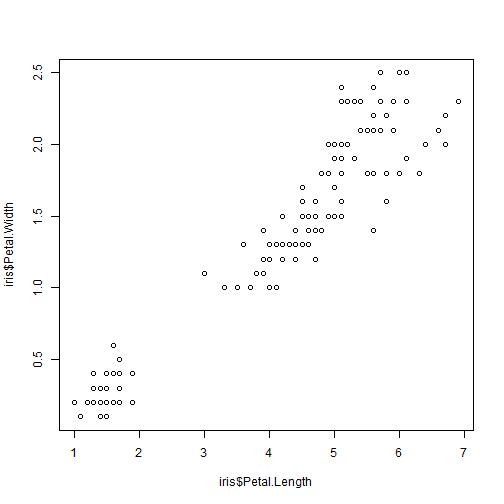

Shiny app
========================================================
author: John & Charles
date: 28/11/2019
autosize: true

- Application : https://charlesmurier.shinyapps.io/MyShinyApp/?fbclid=IwAR2GiAJK-IR6-M6Q1D2A9VVHRafwjWlaotPkWttw-PY1IDBWHVD7kcnxMO4
- Presentation : https://rpubs.com/charlesmurier/Rpresentation?fbclid=IwAR1f_Yvvhs-WXJKJLUGYh5gVNmABwa4j9OoIgwLfQ_1iA1REgeKcVj70bFg
- Github : https://github.com/Milanor9/ShinyApp

What can we do?
========================================================


- Choose a Dataset
- Select the X variable of the Dataset
- Select the Y variable of the Dataset
- Display the plot depending on X and Y

The 3 datasets we can choose
========================================================


```r
head(iris,1)
```

```
  Sepal.Length Sepal.Width Petal.Length Petal.Width Species
1          5.1         3.5          1.4         0.2  setosa
```

```r
head(mtcars,1)
```

```
          mpg cyl disp  hp drat   wt  qsec vs am gear carb
Mazda RX4  21   6  160 110  3.9 2.62 16.46  0  1    4    4
```

```r
head(trees,1)
```

```
  Girth Height Volume
1   8.3     70   10.3
```

An example of plot
========================================================



